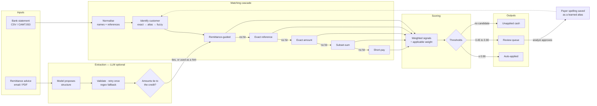

# CashMatch

**An AI cash application agent for Order-to-Cash.** Matches incoming B2B bank payments to
the open invoices they settle, applies cash automatically when confident, and routes
everything else to a human review queue with its reasoning attached.

Measured over 800 synthetic payments worth ₹61.1 crore, against a ground-truth file the
matcher cannot read:

| | |
|---|---|
| **Auto-match rate** | **81.9%** |
| **Precision of auto-applied matches** | **100.00%** — zero wrong, ₹0 misapplied |
| Review rate | 13.0% |
| Unapplied rate | 5.1% |

465 tests. No API key and no network required to run any of them.

---

## The problem

A distributor's customer wires **₹10,94,691.97**. The bank statement line says:

```
21-Jan-2026  NEFT  JAI HIMALAYA SALES CORPORATION
             INV-00410 INV-00032 INV-00879 NET OF DMG CLAIM
```

Nothing there says how to split it. The remittance advice that explains it arrived by
email, separately, with no bank reference tying the two together:

```
> could you confirm when payment for INV-00410 / INV-00032 / INV-00879 will be released?
Sir, transfer of 10,94,691.97/- has been done from our side.
4900.00 deducted - breakage claim for detergent consignment.
```

The correct answer is three invoices, one of them short-paid by ₹4,900 for damaged stock.
An AR analyst works this out by hand, several hundred times a day.

**Two numbers decide whether automating it is worth doing:**

- **Auto-match rate** — how much work disappears.
- **Match precision** — how often the work that disappeared was done *correctly*.

Either alone is meaningless. A system that auto-applies everything scores 100% on the
first and is useless.

---

## Why precision is a constraint, not a goal

The two ways this system can fail do not cost the same.

A payment **sent to review** costs about two minutes: an analyst opens it, agrees with the
suggestion, clicks approve. Bounded, visible, and the ledger entry is still correct.

A payment **auto-applied to the wrong invoice** marks one invoice paid that is not and
leaves another open that should be closed. The customer's balance is wrong in two places.
A dunning letter goes to someone who already paid. A reversal has to be raised, approved,
posted and reconciled — hours across two teams, and none of it starts until the customer
complains.

In rupees, at this project's own ROI assumptions:

| Precision | Gross saving / month | Expected error cost | **Net** |
|---:|---:|---:|---:|
| **100%** | ₹28,260 | ₹0 | **₹28,260** |
| 99% | ₹28,260 | ₹11,790 | ₹16,470 |
| 97% | ₹28,260 | ₹35,370 | **−₹7,110** |
| 95% | ₹28,260 | ₹58,950 | −₹30,690 |

The saving barely moves as precision drops — the automation still happens. The error term
is what grows, until it swallows the benefit entirely. **At 97% precision this system is
net negative.** That asymmetry is the single design constraint everything else follows
from.

---

## Architecture



The cascade **stops at the first step that produces candidates** — 88% of payments never
get past the reference step, so the combinatorial search only runs for the few that need
it. The dashed path is the feedback loop: an analyst approving a match teaches the system
a payer spelling it did not know, and the next payment from that spelling never reaches
the queue.

---

## How to run it

```bash
cp .env.example .env          # every default is already safe
docker compose up --build -d
make demo                     # generate → extract → decide → evaluate
```

| | |
|---|---|
| **Review UI** | <http://localhost:5173> |
| API docs | <http://localhost:8000/docs> |
| Health | <http://localhost:8000/health/db> |

Tear down with `docker compose down -v`.

**Run the tests** — no Docker, no API key, no network:

```bash
cd backend && pip install -e ".[dev]" && pytest -q
```

### The CLI

```bash
cashmatch generate --reset    # synthetic dataset + ground-truth answer key
cashmatch extract             # read remittance advice into invoice lines
cashmatch match --explain     # the cascade, with its full reasoning trail
cashmatch apply               # score and record decisions (suggest-only)
cashmatch apply --post        # also apply the cash to the ledger
cashmatch evaluate            # score against the answer key
cashmatch roi --hourly-cost 800 --minutes 5
```

---

## Results

Measured over **800 payments worth ₹61.1 crore**. The answer key is written at generation
time to `data/ground_truth/`, never loaded into the database the matcher queries, and
opened only after matching has finished.

| Metric | Value |
|---|---|
| **Auto-match rate** | **81.9%** (655 payments) |
| **Precision of auto-applied** | **100.00%** — 0 wrong |
| Precision by value | 100.00% — ₹0 misapplied |
| Review rate | 13.0% (104) |
| Unapplied rate | 5.1% (41) |
| Overall accuracy | 94.2% |
| Deduction reason accuracy | 24.0% (18/75) |

### By scenario

| Scenario | n | Auto | Precision | Accuracy |
|---|---:|---:|---:|---:|
| `exact_single` | 272 | 100% | 100% | 100.0% |
| `bundled_multi` | 144 | 95% | 100% | 100.0% |
| `short_pay_deduction` | 112 | 45% | 100% | **67.0%** |
| `missing_reference` | 80 | 26% | 100% | 90.0% |
| `partial_payment` | 80 | 100% | 100% | 100.0% |
| `typo_reference` | 64 | 100% | 100% | 100.0% |
| `payer_name_variant` | 32 | 97% | 100% | 96.9% |
| `no_matching_invoice` | 16 | 0% | — | 100.0% |

Short-pay is the weak spot, and that is exactly why accuracy is reported per scenario:
averaged into a headline dominated by 272 easy exact matches, a 67% would be invisible.

### Threshold sweep

| Auto ≥ | Auto rate | Precision | Errors | Value at risk |
|---:|---:|---:|---:|---:|
| 0.50 | 94.6% | 97.36% | 20 | ₹2.89 cr |
| 0.55 | 93.8% | 97.47% | 19 | ₹2.65 cr |
| **0.60** | **88.1%** | **100.00%** | **0** | ₹0 |
| 0.80 | 83.0% | 100.00% | 0 | ₹0 |
| **0.90** ← current | **81.9%** | **100.00%** | **0** | ₹0 |
| 1.00 | 46.0% | 100.00% | 0 | ₹0 |

There is a sharp cliff at 0.60: the sweep says it buys 6.2 points more automation for
free. **I would still deploy at 0.90** — the cliff is measured on one synthetic dataset,
and sitting directly on it leaves no margin for failure modes this data does not contain.

`data/generated/evaluation.md` is regenerated by `cashmatch evaluate`, so these numbers
cannot quietly go stale.

---

## What it is worth

```
assumptions (yours to replace)
  volume              800 payments / month
  manual effort       4.0 min / payment
  review effort       2.0 min / item
  analyst cost        600 INR / hour
  cost of one error   3.0 hours to unwind

effort      53.3 h/month today  →  6.2 h/month  =  47.1 hours saved (88%)
money       ₹28,260 / month  ·  ₹3,39,120 / year
```

Every default is an **assumption, not a benchmark** — a starting point for a conversation.
The ROI tab in the UI makes all five editable, and the answer moves with them.

Three things the model refuses to flatter:

- an auto-applied payment costs nothing, but a **review item is not free** — it still
  costs an analyst's attention, just less of it;
- **unapplied cash is not a saving** — the engine declined to guess, and someone still has
  to investigate every one;
- the **expected cost of wrong auto-matches is subtracted**, not ignored.

---

## Design trade-offs

| Decision | Why | What it costs |
|---|---|---|
| **Money is integer paise, never float** | Subset-sum asks "does this set total *exactly* the payment?" thousands of times; over floats that question has no reliable answer | Every read and write crosses a paise↔rupee helper |
| **Rules, not a trained model** | No labelled data on day one; a controller can audit "the reference matched exactly"; thresholds are directly tunable | Hand-tuned weights will eventually be beaten by LightGBM over the same signals |
| **Subset-sum capped at k = 5** | Bounds the search at `Σ C(n,i)` instead of `2ⁿ` — 1.4 million combinations instead of 35 trillion | A genuine 7-invoice bundle is invisible and goes to review |
| **Confidence normalised over *applicable* signals** | A customer who never sends advice is not thereby a worse match | Subtle — and it cost 65 points of auto-match rate before it was found |
| **A guessed claim-bearer goes to review** | Every error in the first evaluation was a multi-invoice short-pay attributed to the wrong invoice within the right set | 5 points of auto-match rate, traded for all 19 errors |
| **Suggest-only by default** | A first deployment runs this way for weeks while the client watches precision | Posting is a second, explicit step |
| **SQLite for tests, Postgres for deploy** | 465 tests in 35 seconds with no Docker | A portable schema, designed in from the first commit |
| **The LLM is optional** | `LLM_MODE=mock` by default; a cold clone runs everything with no credentials | Mock mode is not a benchmark of model quality |

---

## Known limitations

- **100% precision is a property of this dataset, not a promise.** It means no mistakes on
  messiness I thought to model. Real bank files contain failure modes nobody anticipates,
  and this is the first number that moves on contact with real data.
- **Deduction reason accuracy is 24%.** Only 196 of 800 payments have advice linked at
  all, so most claims stay `unknown` — and a claim without a category cannot be routed.
- **Advice is only used when already linked to a payment.** 239 extracted documents sit
  unused, because pairing unlinked advice with a payment is a separate matching problem.
- **One payment per invoice.** The generator never splits an invoice across two payments,
  so the two-instalment case is untested end to end.
- **Amount-only matches never auto-apply.** All 43 were correct here and all went to
  review — deliberate, because synthetic amounts are distinctive in a way a real book with
  round negotiated prices would not be.
- **83 correct matches sit in review.** Head-room: work a human will do that the engine
  already got right.
- **Single currency.** INR only; multi-currency brings FX gain/loss on the application
  date, which is a modelling problem rather than a column.
- **Mobile layout is unverified.** The responsive classes are in place; only desktop was
  visually checked.

---

## Next steps

**Highest value first.**

1. **Pair unlinked advice with payments** (customer + amount + date window). Would roughly
   double the reach of the remittance signal, and it is the clearest path to raising
   deduction reason accuracy above 24%.
2. **Real bank formats** — CAMT.053 and MT940. A parser swap behind the same interface;
   everything downstream takes transaction rows and does not care where they came from.
3. **ML-based scoring** with LightGBM over the existing signals, once there is enough
   review history to train on. The architecture is already shaped for it: the signal
   breakdown is stored on every decision, so the training set builds itself.
4. **ERP integration.** Inbound master data by scheduled extract or API; outbound journal
   postings that are idempotent and reversible — which is what `statement_ref` uniqueness
   and the audit log already exist for.
5. **Per-customer auto-match rates**, to surface which relationships would benefit from
   being asked for structured remittance advice. That conversation — changing the client's
   process rather than only automating around it — is often worth more than the engine.

---

## Project layout

```
backend/cashmatch/
  money.py        integer-paise money handling
  normalize.py    payer-name and reference canonicalisation
  roi.py          hours and rupees saved
  db/             engine, session, portable column types
  models/         the eight tables
  generator/      synthetic data + ground-truth answer key
  matching/       the cascade: references, customer ID, subset-sum, short-pay
  extraction/     advice → structured invoice lines (LLM optional)
  scoring/        signals → confidence → decision → database
  evaluation/     compare against ground truth, sweep the threshold
  api/            twelve REST endpoints
backend/config/   scenarios.yml (dataset shape) · matching.yml (engine tuning)
backend/alembic/  versioned schema migrations
backend/tests/    465 tests, SQLite, no Docker
frontend/         React + Vite + Tailwind review UI, nginx-served
data/             generated data and the answer key (gitignored)
```

### The two config files

`scenarios.yml` describes the **problem** — how many customers, how messy, what mix of
payment shapes. `matching.yml` describes the **attempt at solving it** — prunes,
tolerances, weights, thresholds. Keeping them apart is what makes a change in results
attributable to a cause.

---

## Design rules

1. **Money is never a float.** Integer paise in the database, in Python, and in API
   payloads. `rupees_to_paise()` raises `TypeError` on a float; tests walk the whole schema
   and every API response asserting it.
2. **Deterministic and reproducible.** One `RANDOM_SEED`; the same config always produces
   byte-identical data, and the config is fingerprinted into the answer key.
3. **Never trust an LLM's numbers.** Schema-validated, retried once, and cross-checked
   against the bank credit that actually arrived.
4. **The LLM is optional.** Rules fallback and mock mode; the full suite runs with no key
   and no network.
5. **Every decision is explainable.** Signals, weights, penalties and a human sentence are
   stored on every match — including the signals that did *not* fire.
6. **The matcher can never see the answers.** Ground truth lives in a file, never in the
   database; a test asserts no scenario or truth column exists on `bank_transactions`.

---

A fuller write-up — the domain primer, the data model rationale, every bug found along the
way and an interview Q&A — is maintained as a living document:

**[CashMatch — Engineering Brief](https://claude.ai/code/artifact/150a14bb-b6b3-4fb7-8d5c-5786cbb16caf)**
(source: `docs/interview-brief.html`)
